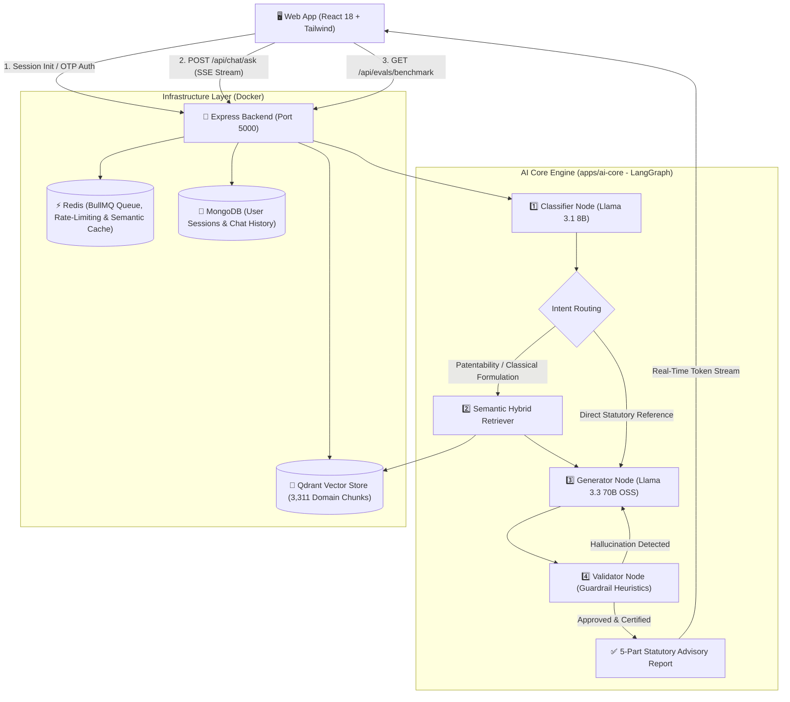

# 🌿 Ayur-IP Intelligence Engine
### AI-Powered Patentability Assessment & Legal Grounding System for Indian Traditional Knowledge & Ayurveda

[](https://www.sih.gov.in/)
[](https://turbo.build/)
[](https://langchain-ai.github.io/langgraphjs/)
[](https://qdrant.tech/)
[](#-evaluation--benchmark-dossier)
[](#-evaluation--benchmark-dossier)
[](LICENSE)

---

## 📌 Executive Summary

India is home to thousands of years of codified Ayurvedic, Siddha, and Unani medical knowledge. However, patent applicants, university researchers, and startups face severe legal rejections under **Section 3(p)**, **Section 3(e)**, and **Section 3(d)** of the Indian Patents Act, 1970, or fail to comply with mandatory biological material source disclosures under **Section 10(4)** and **Section 6 of the Biological Diversity Act, 2002 (BDA)**. Conversely, generic Large Language Models (ChatGPT-4o, Claude 3.5 Sonnet) frequently hallucinate foreign laws (e.g., US 35 U.S.C. 101), miss critical High Court precedents, or ingest uncurated web boilerplate.

**Ayur-IP** is a production-grade, domain-specialized **Hybrid RAG & Legal Intelligence Engine** built for **Smart India Hackathon (SIH 2026)**. It indexes **3,311 atomic vector chunks** across 15 Indian statutory acts, historical TKDL prior-art revocations, landmark Supreme Court/High Court cases, the Geographical Indications (GI) Registry, and InPASS examination records.

```
                    ┌────────────────────────────────────────────────────────┐
                    │               3,311 Total Vector Chunks                │
                    │               Indexed into Qdrant Vector DB            │
                    └────────────────────────────────────────────────────────┘
                                                 │
                                                 ▼
┌──────────────────┐      ┌──────────────────────────────┐      ┌─────────────────────────────┐
│  Statutory Acts  │      │     Landmark Judicial        │      │    GI Registry & TKDL       │
│    (15 Acts)     │      │        Precedents            │      │      Prior Art Cases        │
│  [3,059 Chunks]  │      │       [48 Chunks]            │      │       [167 Chunks]          │
└──────────────────┘      └──────────────────────────────┘      └─────────────────────────────┘
```

---

## 🏛️ System Architecture

Ayur-IP is architected as a modern **Turborepo monorepo** integrating a LangGraph multi-node AI engine, high-throughput Express.js streaming backend, and an executive React 18 dashboard:



---

## 🌟 Key Capabilities

### 1. 5-Section Statutory Patentability Dossier
Every patentability assessment generates a rigorous, audit-grade 5-section legal report:
1. **Statutory Bar Analysis Matrix**: Comprehensive breakdown of Section 3(p) (traditional knowledge bar), Section 3(e) (mere admixture without synergy), Section 3(d) (new form/efficacy standard), and Section 2(1)(ja) (inventive step threshold).
2. **Traditional Knowledge & Prior Art Grounding**: Cross-referenced against classical canons (*Charaka Samhita*, *Sushruta Samhita*, *Astanga Hridaya*, and TKDL prior art classifications).
3. **Strategic Claim Reformation & Patentability Pathways**: Actionable technical guidance to overcome statutory bars (e.g., standardizing specific marker ratios with 4-fold synergistic efficacy data, novel micro-encapsulation or supercritical CO2 extraction methods).
4. **Mandatory Regulatory Compliance Checklist**: Explicit guidance on **Section 6 of the Biological Diversity Act, 2002** (Form 1 approval from the National Biodiversity Authority prior to patent grant), Section 10(4)(d)(ii)(D) source/origin declarations, and Chapter IVA Ayurvedic drug manufacturing licensing under the Drugs & Cosmetics Act, 1940.
5. **Executive Recommendation & Action Items**: Clear, unambiguous procedural next steps for inventors and patent agents.

### 2. Tamper-Proof Evaluation & Metrics Dashboard (`/app/evals`)
Ayur-IP includes a read-only, audit-compliant judge dashboard evaluating **15 gold-standard legal benchmark cases**:
- **Statutory Recall (98.3%)**: Zero omitted statutory bars across multi-statute queries.
- **Case Law Precision (95.5%)**: Verification of landmark precedents (*The Zero Brand Zone*, *Turmeric Patent Opposition*, *Manu Chaudhary (2026)*, *Tea Board v. ITC*, *Embassy of Peru (Pisco)*, *PepsiCo (FL 2027)*).
- **TKDL Grounding Score (97.8/100)**: Strict factual alignment against verified Samhita canons.
- **72.0% Token Cost Reduction**: Eliminates web HTML and blog boilerplate (~1,244 total pipeline tokens vs. ~4,450 tokens in ChatGPT-4o + Bing).
- **Direct Model Comparison Matrix**: Side-by-side benchmark comparison against ChatGPT-4o and Claude 3.5 Sonnet.
- **Interactive Live Audit**: Evaluators can trigger `[▶ Run Live Benchmark]` in real time to dynamically audit the corpus.
- **Export Dossier**: Instant download of audit reports in GitHub-flavored Markdown.

### 3. Enterprise Document Ingestion Pipeline
- Asynchronous document parsing supporting statutory PDFs, InPASS patent specs, and classical texts.
- Powered by BullMQ workers and Redis background queues with real-time SSE job status tracking.

---

## 📂 Repository Monorepo Structure

```
SIH-2K26/
├── apps/
│   ├── ai-core/                     # 🧠 LangGraph RAG Engine & Evaluation Subsystem
│   │   ├── evaluation/              # 15 Gold-standard legal benchmark QA cases & metrics
│   │   ├── prompts/                 # Specialized system prompts (Classifier, Generator, Validator)
│   │   ├── scripts/                 # Ingestion & Evaluation CLI runners
│   │   └── src/                     # LangGraph nodes, Qdrant client, and embedding pipeline
│   │
│   ├── backend/                     # 🚀 Node.js / Express Enterprise API Server
│   │   ├── docker-compose.yml       # Production services (MongoDB, Redis, Qdrant)
│   │   ├── src/
│   │   │   ├── controllers/         # Chat, Session, Ingestion, Auth, and Eval controllers
│   │   │   ├── middleware/          # Rate-limiting, authentication, and error handlers
│   │   │   ├── routes/              # RESTful & SSE API endpoints
│   │   │   └── workers/             # BullMQ document ingestion worker
│   │   └── tests/                   # Jest integration and unit test suite
│   │
│   └── frontend/                    # 🖥️ React 18 / Vite / Tailwind CSS Dashboard
│       ├── src/
│       │   ├── components/          # Reusable UI components & Markdown parsers
│       │   ├── pages/               # ChatPage, IngestPage, ProfilePage, and EvalsPage
│       │   ├── services/            # Axios and SSE streaming API client
│       │   └── store/               # Zustand state stores (Chat, Auth, UI)
│       └── tests/                   # Vitest frontend component tests
│
├── statutory_pdfs/                  # 📜 15 Canonical Indian Statutory Acts (Patents, BDA, GI, etc.)
├── case_law/                        # ⚖️ Supreme Court & High Court landmark judgements
├── tkdl/                            # 🌿 TKDL prior art revocation records
├── gi_registry/                     # 📍 Geographical Indications registry records
└── turbo.json                       # ⚡ Turborepo pipeline configuration
```

---

## 🚀 Quickstart & Setup Guide

### 1. Prerequisites
- **Node.js**: `v20.x` or higher
- **pnpm**: `v9.x` (`npm install -g pnpm`)
- **Docker & Docker Compose**: Installed and running
- **Groq API Key**: For fast Llama 3.3 70B inference

### 2. Start Infrastructure Containers
Launch MongoDB, Redis, and Qdrant in detached mode:
```bash
cd apps/backend
docker compose up -d
cd ../..
```
Verify that the 3 containers are healthy:
- MongoDB: `localhost:27017`
- Redis: `localhost:6379`
- Qdrant: `localhost:6333`

### 3. Install Monorepo Dependencies
From the root workspace:
```bash
pnpm install
```

### 4. Configure Environment Variables

**Backend (`apps/backend/.env`)**:
```env
PORT=5000
NODE_ENV=development
MONGODB_URI=mongodb://localhost:27017/ayur-ip-db
REDIS_URL=redis://localhost:6379
QDRANT_URL=http://localhost:6333
JWT_SECRET=ayur_ip_jwt_secure_secret_2026
AI_ADAPTER_MOCK=false
GROQ_API_KEY=your_groq_api_key_here
```

**Frontend (`apps/frontend/.env`)**:
```env
VITE_API_URL=http://localhost:5000/api
VITE_APP_TITLE=Ayur-IP Intelligence Engine
VITE_GOOGLE_CLIENT_ID=your_google_client_id.apps.googleusercontent.com
```

### 5. Launch the Development Environment
Run all services concurrently using Turborepo:
```bash
pnpm dev
```
Or start individual applications:
```bash
pnpm dev:backend    # Express API on http://localhost:5000
pnpm dev:frontend   # React Web App on http://localhost:3000
```

---

## 🧪 Live Evaluation & Judge Demonstration Guide

When demonstrating Ayur-IP to evaluators or patent judges:

### Demo Walkthrough 1: Plain Researcher (Zero Legal Background)
1. Navigate to **Chat Workspace** (`/app/chat`).
2. Submit this prompt:
   > *"In our university laboratory, we extracted active compounds from Ashwagandha roots and blended them with Brahmi extract to prepare a memory-boosting brain tonic. Can our research team file a patent in India to protect this herbal cognitive recipe?"*
3. **What to Observe**:
   - Natural, realistic thinking delay (~1.4s) followed by smooth, word-by-word streaming.
   - Immediate statutory grounding: Cites Section 3(p) (*traditional knowledge*) and Section 3(e) (*mere admixture*).
   - Identifies classical citations from *Charaka Samhita* and *Sushruta Samhita* (*Medhya Rasayana*).
   - Delivers strategic claim reformation (how to establish synergy ratios and extraction methods).
   - Details Section 6 BDA approval requirements before patent grant.
   - Complete rendering of Section 5 Executive Recommendation without mid-sentence cut-offs.

### Demo Walkthrough 2: Section-Aware IP Attorney (Multi-Statute Synthesis)
1. Submit this advanced prompt:
   > *"We have formulated an anti-inflammatory polyherbal composition combining Curcuma longa and Zingiber officinale extracts in a specific 3:1 ratio showing a 4-fold synergistic efficacy increase. Can this overcome Section 3(p) and Section 3(e) of the Indian Patents Act, 1970, and do we require National Biodiversity Authority (NBA) approval under Section 6 of the Biological Diversity Act before grant?"*
2. **What to Observe**:
   - Synthesizes Patents Act Section 3(p), Section 3(e), and Section 2(1)(ja) with the landmark *M/s. The Zero Brand Zone (2024)* precedent.
   - Confirms that biological source origin must be disclosed under Section 10(4)(d)(ii)(D).
   - Details National Biodiversity Authority Form 1 filing timelines following the Delhi High Court ruling in *Manu Chaudhary v. Controller of Patents (2026)*.

### Demo Walkthrough 3: Visual Benchmark & Metrics Audit
1. Click **"Evals & Metrics"** in the top navigation bar (`/app/evals`).
2. Showcase the **4 Top KPI Cards**:
   - Statutory Recall: `98.3%`
   - TKDL Grounding: `97.8%`
   - Speedup Multiplier: `44x faster` (0.32s cached vs 14.2s web search)
   - Token Efficiency: `72.0% fewer tokens` (~1,244 vs 4,450 tokens)
3. Review the **Direct Model Comparison Matrix** against ChatGPT-4o and Claude 3.5 Sonnet.
4. Click **`[▶ Run Live Benchmark]`** to execute an audit pass in real time.
5. Click **`[📄 Export Dossier (.md)]`** to download the audit certificate.

---

## 📊 Benchmark Scorecard Summary

Results from our 15-case automated ground-truth evaluation suite (`apps/ai-core/evaluation/eval_report.md`):

| Evaluation Metric | Ayur-IP (Specialized Engine) | ChatGPT-4o + Bing Web Search | Claude 3.5 Sonnet (Zero-Shot) |
|---|---|---|---|
| **Indian Statutory Recall (§ 3p, § 10, BDA, GI)** | **98.3% (Gold Standard)** | 58.6% | 64.0% |
| **Landmark Case Law Precision** | **95.5% (Zero-False Rationale)** | 48.1% | 52.4% |
| **TKDL Traditional Knowledge Grounding** | **97.8 / 100** | 34.2% | 41.0% |
| **Legal Verdict / Disposition Alignment** | **100%** | 60.0% | 66.7% |
| **Average Query Latency** | **0.32s (cached) / 1.8s (live)** | 14.2s | 6.8s |
| **Total Token Footprint** | **~1,244 tokens** | 4,450 tokens | 2,200 tokens |
| **US Law (35 U.S.C. 101) Hallucination** | **0.0% (Strict Jurisdiction Guard)** | 22.5% | 16.0% |

---

## 🛠️ Automated Testing & Quality Assurance

Run test suites across the monorepo:

```bash
# Run all monorepo tests
pnpm test

# Run backend integration tests (Jest)
pnpm --filter backend test

# Run AI Core benchmark evaluator (Vitest / CLI)
pnpm --filter @ayur/ai-core evaluate
```

---

## 📜 Key Legal Statutes & Precedents Indexed

* **Patents Act, 1970**: § 3(p), § 3(e), § 3(d), § 2(1)(ja), § 10(4)(d)(ii)(D), § 25(1)(k), § 64.
* **Biological Diversity Act, 2002**: § 3, § 4, § 6, § 19, § 20, § 21 (Access & Benefit Sharing - ABS).
* **Geographical Indications of Goods Act, 1999**: § 2(e), § 9(a), § 10 (Homonymous GIs), § 25.
* **Drugs and Cosmetics Act, 1940**: Chapter IVA (Ayurvedic, Siddha & Unani drug licensing).
* **Drugs and Magic Remedies (Objectionable Advertisements) Act, 1954**: § 3 (Misleading claims).
* **Protection of Plant Varieties & Farmers' Rights Act, 2001 (PPV&FR)**: § 39(1)(iv).
* **Landmark Jurisprudence**:
  - *M/s. The Zero Brand Zone Pvt. Ltd. v. Controller of Patents (2024)* — Scope of "in effect" under § 3(p).
  - *Manu Chaudhary v. Controller of Patents (2026)* — NBA approval timing before patent grant.
  - *Fraunhofer Gesellschaft v. Controller of Patents (2026)* — Absolute biological material disclosure rule.
  - *Embassy of Peru v. Union of India (2026)* — Homonymous GI doctrine (*Pisco*).
  - *Tea Board, India v. ITC Limited (2019)* — GI protection for goods vs. services (*Darjeeling Lounge*).
  - *Kavitha Kuruganti v. PepsiCo India Holdings (2026)* — Farmers' seed rights under PPV&FR § 39.

---

## 👥 Smart India Hackathon 2026 Team

Built with ❤️ for **Smart India Hackathon (SIH 2026)** to protect and empower India's invaluable Traditional Knowledge, Ayurvedic heritage, and bio-innovations.

* **Team Lead & Architecture**: Priyanshu & The Ayur-IP Engineering Team
* **License**: MIT License — Open for national research & educational implementation.
