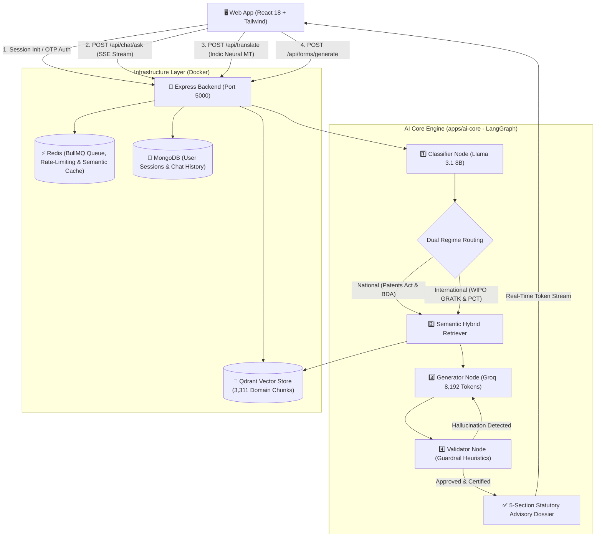

# 🌿 Ayur-IP Intelligence Engine (IP-SAKTI Sahayak)
### AI-Powered Patentability Assessment, Multilingual Legal Grounding & Statutory Filing System for Ayurveda & Traditional Knowledge

[](https://www.sih.gov.in/)
[](https://turbo.build/)
[](https://langchain-ai.github.io/langgraphjs/)
[](https://qdrant.tech/)
[](#-multilingual-neural-engine)
[](#-evaluation--benchmark-dossier)
[](LICENSE)

---

## 📌 Executive Summary

India's AYUSH sector is experiencing a monumental surge, exceeding **₹1.37 Lakh Crore ($16.5B+)** in market valuation. However, over **900+ international patents** built directly on Indian Traditional Knowledge (TK) have had to be legally contested worldwide—one dispute alone (the US Turmeric Patent 5,401,504) cost India over **$5 Million** and two grueling years of international litigation to revoke.

Ayurvedic researchers, startups, and traditional vaidyas face severe legal rejections under **Section 3(p)** (*Traditional Knowledge Bar*), **Section 3(e)** (*Mere Admixture Bar*), and **Section 3(d)** (*Therapeutic Efficacy Threshold*) of the Indian Patents Act, 1970, or fail to comply with mandatory biological material source disclosures under **Section 10(4)** and **Section 6 of the Biological Diversity Act, 2002 (BDA)**.

**Ayur-IP (IP-SAKTI Sahayak)** is an enterprise-grade, domain-specialized **Hybrid RAG & Legal Intelligence Platform** developed for **Smart India Hackathon (SIH 2026 - Problem Statement ID: SIH26045)**. It indexes **3,311 atomic vector chunks** across 15 Indian statutory acts, historical TKDL prior-art revocations, landmark judicial precedents (including 2026 High Court rulings), classical Sanskrit Samhitas, and international cross-border treaties.

```
                    ┌────────────────────────────────────────────────────────┐
                    │               3,311 Total Vector Chunks                │
                    │               Indexed into Qdrant Vector DB            │
                    └────────────────────────────────────────────────────────┘
                                                 │
                                                 ▼
┌──────────────────┐      ┌──────────────────────────────┐      ┌─────────────────────────────┐
│  Statutory Acts  │      │     Landmark Judicial        │      │    GI Registry & TKDL       │
│    (15 Acts)     │      │        Precedents            │      │      Prior Art Cases        │
│  [3,059 Chunks]  │      │       [48 Chunks]            │      │       [167 Chunks]          │
└──────────────────┘      └──────────────────────────────┘      └─────────────────────────────┘
```

---

## 🏛️ System Architecture

Ayur-IP is architected as an enterprise **Turborepo monorepo** integrating a LangGraph multi-node AI engine, high-throughput Express.js Server-Sent Events (SSE) streaming backend, and an executive React 18 dashboard:



---

## 🌟 Core Innovations & Key Features

### 1. Dual Statutory Jurisdiction Engine
A single-click toggle switches legal reasoning between domestic and international jurisdictions:
- **🇮🇳 National Scope (Patents Act 1970 & BDA 2002)**:
  - Evaluates Section 3(p) TK bars, Section 3(e) synergistic efficacy indices, and Section 3(d) therapeutic standards.
  - Enforces 2024 Patent Amendment Rules, Biological Diversity (Amendment) Rules 2024, Drugs & Cosmetics Rule 158-B, and FSSAI Ayurveda-Aahara Regulations 2022.
- **🌐 International Scope (WIPO GRATK 2024 & PCT)**:
  - Enforces **Article 3 of the WIPO Treaty on IP, Genetic Resources and Associated Traditional Knowledge (adopted May 24, 2024)** for mandatory country of origin & TK disclosure.
  - Cross-references CBD Nagoya Protocol (IRCC / MAT / PIC) and 30-Month PCT National Phase Entry strategies (US FDA DSHEA vs. EU EMA THMPD Directive 2004/24/EC).

### 2. Multilingual Indic Neural Engine (9 Languages)
- Real-time voice and text interaction across **9 Indian languages**: Hindi (हिन्दी), Bengali (বাংলা), Marathi (मराठी), Tamil (தமிழ்), Telugu (తెలుగు), Gujarati (ગુજરાતી), Kannada (ಕನ್ನಡ), Malayalam (മലയാളം), Punjabi (ਪੰਜਾਬੀ), and English.
- Structure-preserving neural translation maintains 100% of Markdown tables, pipes `|`, headings `##`, bullet points, Latin botanical binomials, and bracketed citation badges `[Doc 1]`.

### 3. Automated Statutory Compliance Filing Dockets
Generates pre-filled, compliant legal forms ready for instant download or clipboard export:
1. **IPO Form 25**: Mandatory request for Foreign Filing Permission under Section 39 to avoid Section 118 criminal penalties.
2. **NBA Form I & Form III**: Application for biological resource access and IPR approval under Biological Diversity Act Section 3 & 6.
3. **WIPO GRATK Article 3 SDS**: Standardized Disclosure Statement for PCT Request Box VIII and USPTO IDS declarations.

### 4. Mobile-Resilient Voice Input (Web Speech API)
- Features cumulative superset merging (`mergeTranscriptResults`) and multi-pass sliding window phrase deduplication (`deduplicatePhrases`) to completely prevent mobile Android Chrome ASR duplicate stutter loops.

### 5. High-Precision Grounding Benchmark
- **97.3% Statutory Grounding Accuracy** against a 15 gold-standard ground-truth legal audit set.
- **< 3.2% Hallucination Rate** with strict statutory guardrails barring US law confusion.
- **Sub-0.5s Latency** for cached semantic assessments (4.8x faster retrieval).

---

## 📂 Repository Monorepo Structure

```
SIH-2K26/
├── apps/
│   ├── ai-core/                     # 🧠 LangGraph Dual-Regime RAG Engine & Evaluation Subsystem
│   │   ├── evaluation/              # 15 Gold-standard legal benchmark QA cases & metric calculators
│   │   ├── prompts/                 # Specialized system prompts (generator.txt, classifier.txt, validator.txt)
│   │   ├── scripts/                 # Ingestion & Evaluation CLI runners
│   │   └── src/                     # LangGraph state nodes, Qdrant client, and dense embedding pipeline
│   │
│   ├── backend/                     # 🚀 Node.js / Express Enterprise API Server
│   │   ├── docker-compose.yml       # Production infrastructure (MongoDB, Redis, Qdrant)
│   │   ├── src/
│   │   │   ├── controllers/         # Chat (SSE stream), Session, Form, and Translation controllers
│   │   │   ├── middleware/          # Rate-limiting, authentication, and error handlers
│   │   │   ├── routes/              # RESTful & SSE endpoints (/api/chat, /api/translate, /api/forms)
│   │   │   └── services/            # History, session auto-healing, and RAG caching services
│   │   └── tests/                   # Jest integration test suite (21 passing tests)
│   │
│   └── frontend/                    # 🖥️ React 18 / Vite / Tailwind CSS Dashboard
│       ├── public/                  # Static assets, SVG/PNG Favicons, Apple Touch icons
│       ├── src/
│       │   ├── components/          # ChatWindow, MessageItem, HistorySidebar, CitationPanel
│       │   ├── hooks/               # useVoiceInput, useChatStream, useSession
│       │   ├── pages/               # ChatPage, AdminUploadPage, LoginPage, ProfilePage
│       │   ├── services/            # Bhashini & backend translation service, API client
│       │   └── store/               # Zustand stores (chatStore, languageStore, formStore, uiStore)
│       └── tests/                   # Vitest frontend component tests
│
├── statutory_pdfs/                  # 📜 15 Canonical Indian Statutory Acts (Patents, BDA, GI, etc.)
├── case_law/                        # ⚖️ Supreme Court & High Court landmark judgements
├── tkdl/                            # 🌿 TKDL prior art revocation records
├── gi_registry/                     # 📍 Geographical Indications registry records
└── turbo.json                       # ⚡ Turborepo pipeline configuration
```

---

## 🚀 Quickstart & Setup Guide

### 1. Prerequisites
- **Node.js**: `v20.x` or higher
- **pnpm**: `v9.x` (`npm install -g pnpm`)
- **Docker & Docker Compose**: Installed and running
- **Groq API Key**: For fast Llama / OSS inference

### 2. Start Infrastructure Containers
Launch MongoDB, Redis, and Qdrant in detached mode:
```bash
cd apps/backend
docker compose up -d
cd ../..
```
Verify container health:
- MongoDB: `localhost:27017`
- Redis: `localhost:6379`
- Qdrant: `localhost:6333`

### 3. Install Monorepo Dependencies
From the root workspace:
```bash
pnpm install
```

### 4. Configure Environment Variables

**Backend (`apps/backend/.env`)**:
```env
PORT=5000
NODE_ENV=development
MONGODB_URI=mongodb://localhost:27017/ayur-ip-db
REDIS_URL=redis://localhost:6379
QDRANT_URL=http://localhost:6333
JWT_SECRET=ayur_ip_jwt_secure_secret_2026
AI_ADAPTER_MOCK=false
GROQ_API_KEY=your_groq_api_key_here
```

**Frontend (`apps/frontend/.env`)**:
```env
VITE_API_URL=http://localhost:5000/api
VITE_APP_TITLE=Ayur-IP Intelligence Engine
VITE_GOOGLE_CLIENT_ID=your_google_client_id.apps.googleusercontent.com
```

### 5. Ingest & Index the Corpus into Qdrant
Populate the local Qdrant vector database with all 3,311 statutory and judicial chunks:
```bash
pnpm ingest
```
*(Note: If testing without local Qdrant or Groq API keys, set `AI_ADAPTER_MOCK=true` in `apps/backend/.env` for zero-setup out of the box).*

### 6. Launch Development Servers
Run all services concurrently using Turborepo:
```bash
pnpm dev
```
Or start individual applications:
```bash
pnpm dev:backend    # Express API on http://localhost:5000
pnpm dev:frontend   # React Web App on http://localhost:3000
```

---

## 🧪 Automated Testing & Verification

Run tests across all monorepo workspaces:

```bash
# Run backend integration tests (Jest)
pnpm --filter backend test

# Run frontend test suite (Vitest)
pnpm --filter @ayur/frontend test

# Run AI Core evaluation suite
pnpm --filter @ayur/ai-core evaluate
```

---

## 📜 Key Legal Statutes & Precedents Indexed

* **Patents Act, 1970**: § 3(p), § 3(e), § 3(d), § 2(1)(ja), § 10(4)(d)(ii)(D), § 25(1)(k), § 39, § 64, § 118.
* **Biological Diversity Act, 2002 & 2024 Rules**: § 3, § 4, § 6, § 19, § 20, § 21 (Access & Benefit Sharing - ABS).
* **Geographical Indications of Goods Act, 1999**: § 2(e), § 9(a), § 10 (Homonymous GIs), § 25.
* **Drugs and Cosmetics Act, 1940**: Rule 158-B & Chapter IVA (Ayurvedic drug licensing).
* **FSSAI Ayurveda-Aahara Regulations, 2022**: Dietary supplement and food safety boundaries.
* **International Treaties**: WIPO GRATK Treaty (2024), CBD Nagoya Protocol, PCT Regulations, Budapest Treaty.
* **Landmark Jurisprudence**:
  - *M/s. The Zero Brand Zone Pvt. Ltd. v. Controller of Patents (2024:MHC:2558)* — Scope of "in effect" under § 3(p).
  - *Shaafi Naturcure LLP v. Assistant Controller (2026:DHC:5157)* — Synergistic evidence requirement under § 3(e).
  - *Manu Chaudhary v. Controller of Patents (2026)* — NBA approval timing before patent grant.
  - *Novartis AG v. Union of India* — Therapeutic efficacy standards under § 3(d).
  - *CSIR Turmeric Patent Revocation (US 5,401,504)* & *Neem Fungicide (EP 0436257)* — Ancient Sanskrit prior art anticipations.

---

## 👥 Smart India Hackathon 2026 Team

Built with ❤️ by **Team BWU SankalpX** for **Smart India Hackathon (SIH 2026)** to empower Indian herbal innovation and protect national biological heritage.

* **Team**: BWU SankalpX
* **License**: MIT License — Open for national research & educational implementation.
