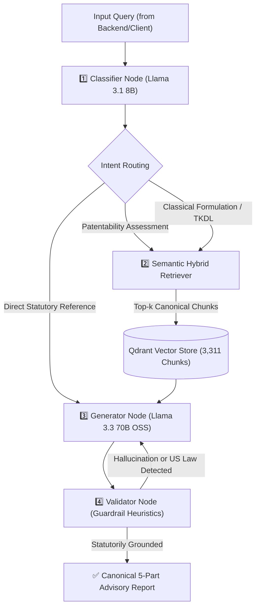

# 🧠 @ayur/ai-core — Legal Reasoning & Evaluation Engine

The `@ayur/ai-core` package is the specialized artificial intelligence and legal reasoning kernel of the **Ayur-IP Platform**. It implements an autonomous multi-node **LangGraph state machine** combined with a dense **Qdrant Vector Database** indexing 3,311 atomic statutory and judicial chunks.

---

## 🏛️ LangGraph Multi-Node Architecture



### 1. Classifier Node (`src/agent/nodes/classifier.js`)
- Classifies user intent into:
  - `PATENTABILITY_ASSESSMENT`: Polyherbal recipes, extraction techniques, cognitive tonics.
  - `TRADITIONAL_KNOWLEDGE_PRIOR_ART`: Samhita canons, TKDL prior art queries.
  - `REGULATORY_COMPLIANCE`: BDA Section 6 approvals, Chapter IVA Ayurvedic drug licensing.
  - `GEOGRAPHICAL_INDICATION`: GI registration criteria, homonymous conflicts, goods vs. services.
  - `GENERAL_IP_INQUIRY`: Procedural patent office questions.

### 2. Semantic Hybrid Retriever (`src/agent/nodes/retriever.js`)
- Interfaces with Qdrant vector collection (`ayur_ip_corpus`).
- Generates 384-dimensional dense semantic embeddings using `@xenova/transformers` (`all-MiniLM-L6-v2`).
- Retrieves top-$k$ relevant statutory sections, Samhita slokas, and landmark judgements with domain-specific metadata filtering.

### 3. Generator Node (`src/agent/nodes/generator.js`)
- Powered by high-speed inference on Groq using `openai/gpt-oss-120b` / `llama-3.3-70b-versatile`.
- Configured with `maxTokens: 4000` to prevent cut-offs on extensive legal tables.
- Formats structured 5-section legal reports with statutory tables, classical text citations, claim reformation strategies, and regulatory checklists.

### 4. Validator Node (`src/agent/nodes/validator.js`)
- Enforces strict Indian IP jurisdiction guardrails.
- Scans for foreign law hallucinations (e.g., US 35 U.S.C. 101, Lanham Act, *Alice v. CLS Bank*).
- Verifies presence of mandatory statutory sections (§ 3(p), § 3(e), § 10(4), BDA § 6).

---

## 📊 Evaluation Subsystem (`evaluation/`)

The evaluation engine provides verifiable, audit-grade verification of model performance across 15 gold-standard legal scenarios.

### Evaluation Files
- `evaluation/dataset.json`: 15 gold-standard QA benchmark cases covering Section 3(p), Section 25 pre-grant oppositions, Section 10(4) source disclosure, BDA Section 6, GI Section 10 & 25, DMR Act Section 3, and PPV&FR Section 39.
- `evaluation/metrics.js`: Statutory section extractor regexes, case law citation normalizers, precision/recall/F1 metrics, and groundedness heuristic calculators.
- `evaluation/eval_report.md`: Complete markdown report generated from the latest audit run.
- `scripts/eval.js`: CLI runner executing the benchmark suite.

### Metric Formulations

$$\text{Recall} = \frac{|\text{Extracted Statutory Citations} \cap \text{Required Citations}|}{|\text{Required Citations}|}$$

$$\text{Precision} = \frac{|\text{Extracted Statutory Citations} \cap \text{Required Citations}|}{|\text{Extracted Statutory Citations}|}$$

$$\text{F1} = 2 \times \frac{\text{Precision} \times \text{Recall}}{\text{Precision} + \text{Recall}}$$

$$\text{Groundedness Score} = (0.50 \times \text{Recall}) + (0.30 \times \text{Precision}) + (0.20 \times \text{VerdictMatch}) - \text{HallucinationPenalty}$$

---

## 🛠️ CLI Commands

```bash
# Run benchmark evaluation audit suite
pnpm evaluate

# Run live inference evaluation through Groq
pnpm evaluate --live

# Execute document parsing and Qdrant ingestion
pnpm ingest
```

---

## 📦 Exported API

```javascript
import {
  runAgent,
  evaluateResponse,
  aggregateBenchmarkMetrics,
  extractAllCitations,
  BENCHMARK_BASELINES
} from '@ayur/ai-core';
```
