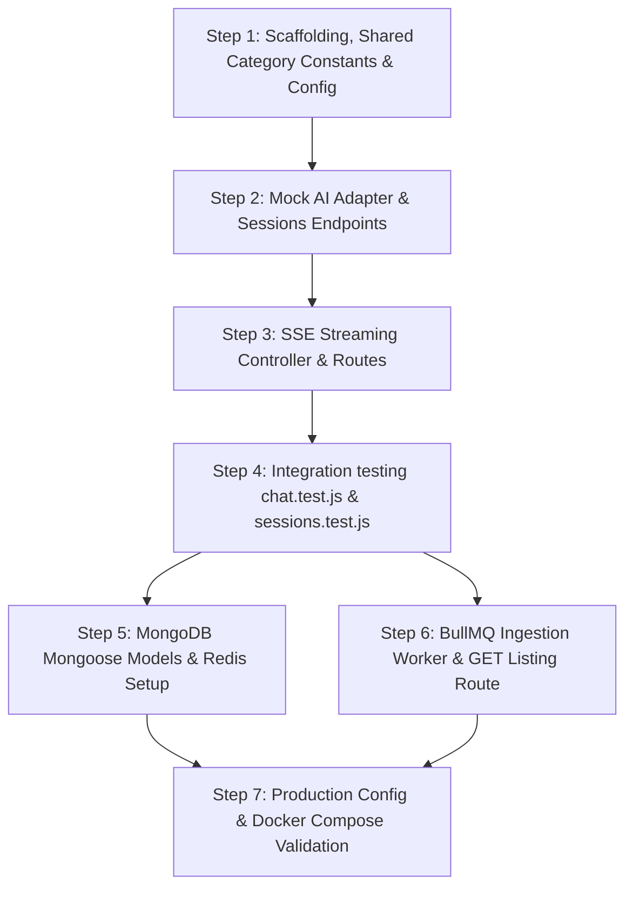

# Implementation Plan: Ayurveda IP Classification Backend Scaffold

This plan outlines the testing strategies, prioritized build sequence, and project files to establish a functional, production-ready backend orchestration service for the Ayurveda IP classification RAG assistant.

---

## User Review Required

> [!IMPORTANT]
> - **Reconciliation Contract Alignment (v6):** This final implementation design locks in cross-module system contracts:
>   - **Filename Retention:** Adds `filename` directly to the `IngestionJob` schema, which is populated from the uploaded file's original name (`req.file.originalname`), separate from any user-defined titles.
>   - **Metric Alignment:** Replaces the uncomputed `wordCount` with `chunkCount`, populated straight from the existing `ingestedCount` DB field in both status and listing responses.
>   - **Pipeline Step Removal:** Descopes the uncomputed `pipelineStep` field from status check endpoints.
>   - **Canonical Category Enum:** Standardized system-wide to `classical_text | patent_doc | legal_precedent | guideline`, stored in a shared file `src/constants/documentCategory.js`.
>   - **Session Creation Status Code:** Pinned to HTTP `201 Created` for successful session registrations.
> - **Infrastructure Requirements:** This stack uses **MongoDB** for document/chat persistence, **Redis** for rate limiting and backing the **BullMQ** queue. These services must be running locally or via the docker-compose stack.

---

## Project Folder Structure

Below is the complete project layout tree showing where all components reside:

```text
ayur-ip-backend/
├── .env.example                     # Template for environment variables (API keys, ports, DB URLs)
├── .gitignore                       # Standard Git exclusions (node_modules, .env, uploads/)
├── Dockerfile                       # Multi-stage Docker build config for production/dev runtimes
├── docker-compose.yml               # Local stack definition (Backend + Qdrant container)
├── package.json                     # Monorepo/workspace root package configuration
├── README.md                        # Documentation on how to run, test, and ingest documents
│
├── src/                             # Application source code (using ESM module syntax)
│   ├── app.js                       # Express app configuration (middlewares, route registration)
│   ├── server.js                    # Server startup script, port listener, and graceful shutdown handlers
│   │
│   ├── config/                      # Application configuration modules
│   │   ├── index.js                 # Unified configuration entry point using Zod parsing for schema safety
│   │   └── logger.js                # Winston or Pino logger configuration for structured JSON output
│   │
│   ├── constants/                   # Shared system-wide constants
│   │   └── documentCategory.js      # Shared canonical category list for uploads
│   │
│   ├── routes/                      # Route registry definitions mapping endpoints to controllers
│   │   ├── index.js                 # Master router aggregation
│   │   ├── sessions.js              # Session creation endpoint routing
│   │   ├── auth.js                  # Routes for mock auth/session generation for demo tracking
│   │   ├── chat.js                  # Chat query endpoints (including streaming /ask endpoint)
│   │   ├── documents.js             # Document upload, listing, and ingestion status routes
│   │   ├── history.js               # Session history CRUD endpoints
│   │   └── health.js                # Liveness/readiness probe checks
│   │
│   ├── controllers/                 # HTTP controllers handling request lifecycle, calling services
│   │   ├── session.controller.js    # Creates and returns a Mongoose Session (HTTP 201 Created)
│   │   ├── auth.controller.js       # Handles session creation and user context assignment
│   │   ├── chat.controller.js       # Handles /ask, manages SSE response headers, streams AI outputs
│   │   ├── document.controller.js   # Handles file uploads, listing queries, status polls
│   │   ├── history.controller.js    # Manages CRUD logic for retrieving past chat interactions
│   │   └── health.controller.js     # Returns status of external connections (Qdrant, Redis, MongoDB)
│   │
│   ├── middleware/                  # Express middleware chain layers
│   │   ├── auth.middleware.js       # Validates session tokens/headers to populate req.user context
│   │   ├── error.middleware.js      # Global error catcher formatting exceptions safely for clients
│   │   ├── rateLimiter.middleware.js# IP & token-based rate limiter (prevents exceeding Groq limits)
│   │   └── validator.middleware.js  # Generic middleware using Zod schemas to validate requests
│   │
│   ├── schemas/                     # Zod request/response validation schemas
│   │   ├── session.schema.js        # Validates session creation parameters
│   │   ├── chat.schema.js           # Validates queries, stream preferences, and session ObjectIds
│   │   ├── document.schema.js       # Validates file metadata fields and upload constraints
│   │   └── history.schema.js        # Validates query params for pagination and session retrieval
│   │
│   ├── services/                    # Business logic layer (databases, state, external APIs)
│   │   ├── qdrant.service.js        # Wrapper for @qdrant/js-client-rest client instantiation
│   │   └── history.service.js       # Session store adapter querying MongoDB via message collections
│   │
│   ├── adapters/                    # In-process bridge to the external AI/ML package
│   │   ├── ai.adapter.js            # Dynamic interface pointing to runAgentStream with payload signature
│   │   └── mockAi.adapter.js        # Mock adapter returning mock citations/responses (canonical shape)
│   │
│   └── workers/                     # Background workers for heavy computations
│       ├── queue.js                 # Ingestion job queue setup (BullMQ using Redis connection)
│       └── ingestion.worker.js      # Ingestion pipeline worker delegating to runIngestion
│
├── storage/                         # Local storage folders (ignored by git, mounted as volume)
│   └── uploads/                     # Temp directory for uploaded PDFs/documents before ingestion
│
└── tests/                           # Test suite
    ├── setup.js                     # Global test setup (mocking env vars, setting up databases)
    ├── unit/                        # Unit tests checking controllers, middleware, services in isolation
    │   ├── rateLimiter.test.js      # Verifies rate limits are applied correctly
    │   └── validator.test.js        # Verifies Zod validation works on mock payloads
    └── integration/                 # Integration tests with Supertest testing end-to-end flows
        ├── sessions.test.js         # Verifies session creation endpoints
        ├── chat.test.js             # Verifies /ask streaming endpoints with mocked AI adapter
        └── documents.test.js        # Simulates uploads, status polling, and listings
```

---

## Open Questions

> [!NOTE]
> - All cross-module contracts have been reconciled and resolved. There are no outstanding open questions.

---

## Proposed Changes

Every file listed in the project folder structure will be initialized and configured as follows:

### Project Scaffolding & Config Files

#### [NEW] [package.json](file:///C:/Users/PRIYANSHU/.gemini/antigravity/scratch/ayur-ip-backend/package.json)
Workspace configuration, script definitions, and dependencies (`express`, `mongoose`, `ioredis`, `bullmq`, `zod`, `multer`, `winston`, `dotenv`, `express-rate-limit`, `rate-limit-redis`, `@qdrant/js-client-rest`).

#### [NEW] [Dockerfile](file:///C:/Users/PRIYANSHU/.gemini/antigravity/scratch/ayur-ip-backend/Dockerfile)
Multi-stage Docker environment build script.

#### [NEW] [docker-compose.yml](file:///C:/Users/PRIYANSHU/.gemini/antigravity/scratch/ayur-ip-backend/docker-compose.yml)
Compose file defining Node server, MongoDB, Redis, and Qdrant containers.

#### [NEW] [.env.example](file:///C:/Users/PRIYANSHU/.gemini/antigravity/scratch/ayur-ip-backend/.env.example)
Template for environmental keys (port, DB URI, API keys, and adapter toggle config).

#### [NEW] [.gitignore](file:///C:/Users/PRIYANSHU/.gemini/antigravity/scratch/ayur-ip-backend/.gitignore)
Explicit directory exclusions (node_modules, files, configs, local uploads).

#### [NEW] [README.md](file:///C:/Users/PRIYANSHU/.gemini/antigravity/scratch/ayur-ip-backend/README.md)
Startup instructions, API payloads, vector ingestion endpoints mapping guide.

---

### Shared Constants

#### [NEW] [src/constants/documentCategory.js](file:///C:/Users/PRIYANSHU/.gemini/antigravity/scratch/ayur-ip-backend/src/constants/documentCategory.js)
Defines and exports the canonical category enum list: `['classical_text', 'patent_doc', 'legal_precedent', 'guideline']`.

---

### Core Application Entry Points

#### [NEW] [src/app.js](file:///C:/Users/PRIYANSHU/.gemini/antigravity/scratch/ayur-ip-backend/src/app.js)
Aggregates Express configuration, configures global filters, mounts endpoints, and defines global error filters.

#### [NEW] [src/server.js](file:///C:/Users/PRIYANSHU/.gemini/antigravity/scratch/ayur-ip-backend/src/server.js)
Port listener binding DB and Redis connections on start and cleaning connections gracefully on SIGTERM/SIGINT.

#### [NEW] [src/config/index.js](file:///C:/Users/PRIYANSHU/.gemini/antigravity/scratch/ayur-ip-backend/src/config/index.js)
Loads configurations using Zod parameters verification.

#### [NEW] [src/config/logger.js](file:///C:/Users/PRIYANSHU/.gemini/antigravity/scratch/ayur-ip-backend/src/config/logger.js)
Standardizes formatted JSON log entries (Pino/Winston logs setup).

---

### Route Layouts (`src/routes/`)

#### [NEW] [src/routes/index.js](file:///C:/Users/PRIYANSHU/.gemini/antigravity/scratch/ayur-ip-backend/src/routes/index.js)
Main routing index file mapping routes together (including mounting `/api/sessions`).

#### [NEW] [src/routes/sessions.js](file:///C:/Users/PRIYANSHU/.gemini/antigravity/scratch/ayur-ip-backend/src/routes/sessions.js)
Route mapping for session creation `POST /api/sessions`.

#### [NEW] [src/routes/auth.js](file:///C:/Users/PRIYANSHU/.gemini/antigravity/scratch/ayur-ip-backend/src/routes/auth.js)
Endpoints for session tokens/mock auth lifecycle endpoints.

#### [NEW] [src/routes/chat.js](file:///C:/Users/PRIYANSHU/.gemini/antigravity/scratch/ayur-ip-backend/src/routes/chat.js)
Chat endpoints including streaming `/ask` endpoint routing layout.

#### [NEW] [src/routes/documents.js](file:///C:/Users/PRIYANSHU/.gemini/antigravity/scratch/ayur-ip-backend/src/routes/documents.js)
Document routes: upload PDF `POST /api/sessions/:sessionId/documents`, list documents `GET /api/documents`, and check ingestion status `GET /api/documents/status/:documentId`.

#### [NEW] [src/routes/history.js](file:///C:/Users/PRIYANSHU/.gemini/antigravity/scratch/ayur-ip-backend/src/routes/history.js)
CRUD routing mapping endpoints for session messaging extraction.

#### [NEW] [src/routes/health.js](file:///C:/Users/PRIYANSHU/.gemini/antigravity/scratch/ayur-ip-backend/src/routes/health.js)
Liveness probes verifying Redis, Mongo, and Qdrant readiness connections.

---

### HTTP Controllers (`src/controllers/`)

#### [NEW] [src/controllers/session.controller.js](file:///C:/Users/PRIYANSHU/.gemini/antigravity/scratch/ayur-ip-backend/src/controllers/session.controller.js)
Creates a Mongoose Session, returning the hex ObjectId and sending an explicit `201 Created` status code.

#### [NEW] [src/controllers/auth.controller.js](file:///C:/Users/PRIYANSHU/.gemini/antigravity/scratch/ayur-ip-backend/src/controllers/auth.controller.js)
Mock authentication handlers assigning test session variables.

#### [NEW] [src/controllers/chat.controller.js](file:///C:/Users/PRIYANSHU/.gemini/antigravity/scratch/ayur-ip-backend/src/controllers/chat.controller.js)
Configures SSE headers and processes real-time generator tokens to write output streams in single-line JSON framing with single terminal validation checks.

#### [NEW] [src/controllers/document.controller.js](file:///C:/Users/PRIYANSHU/.gemini/antigravity/scratch/ayur-ip-backend/src/controllers/document.controller.js)
Handles upload validation (populating `filename` from `req.file.originalname`), job registration, and listing queries (`listDocuments`).
- `listDocuments`: selects `filename`, `category`, `createdAt` (as `uploadedAt`), `ingestedCount` (as `chunkCount`), and lowercased `status`.
- Status-poll: selects `filename`, lowercased `status`, `progress`, and `errorMessage` (as `error`). Removes `pipelineStep`.

#### [NEW] [src/controllers/history.controller.js](file:///C:/Users/PRIYANSHU/.gemini/antigravity/scratch/ayur-ip-backend/src/controllers/history.controller.js)
Queries saved session logs with pagination controls.

#### [NEW] [src/controllers/health.controller.js](file:///C:/Users/PRIYANSHU/.gemini/antigravity/scratch/ayur-ip-backend/src/controllers/health.controller.js)
Collects system component heartbeats and formats health diagnostic records.

---

### Request Validator Middlewares (`src/middleware/`)

#### [NEW] [src/middleware/auth.middleware.js](file:///C:/Users/PRIYANSHU/.gemini/antigravity/scratch/ayur-ip-backend/src/middleware/auth.middleware.js)
Extracts authorization tokens and maps session values onto requests.

#### [NEW] [src/middleware/error.middleware.js](file:///C:/Users/PRIYANSHU/.gemini/antigravity/scratch/ayur-ip-backend/src/middleware/error.middleware.js)
Converts system validation errors into structured client JSON formats.

#### [NEW] [src/middleware/rateLimiter.middleware.js](file:///C:/Users/PRIYANSHU/.gemini/antigravity/scratch/ayur-ip-backend/src/middleware/rateLimiter.middleware.js)
Applies limits per session using Redis-backed token buckets.

#### [NEW] [src/middleware/validator.middleware.js](file:///C:/Users/PRIYANSHU/.gemini/antigravity/scratch/ayur-ip-backend/src/middleware/validator.middleware.js)
Intercepts requests, validating bodies and inputs using Zod definitions.

---

### Request/Response Schemas (`src/schemas/`)

#### [NEW] [src/schemas/session.schema.js](file:///C:/Users/PRIYANSHU/.gemini/antigravity/scratch/ayur-ip-backend/src/schemas/session.schema.js)
Zod validation structure for creation requests (e.g. optional title string).

#### [NEW] [src/schemas/chat.schema.js](file:///C:/Users/PRIYANSHU/.gemini/antigravity/scratch/ayur-ip-backend/src/schemas/chat.schema.js)
Zod definition validating ask query lengths and 24-character hexadecimal MongoDB ObjectIds.

#### [NEW] [src/schemas/document.schema.js](file:///C:/Users/PRIYANSHU/.gemini/antigravity/scratch/ayur-ip-backend/src/schemas/document.schema.js)
Zod validation structure for document upload route `POST /api/sessions/:sessionId/documents`.

#### [NEW] [src/schemas/history.schema.js](file:///C:/Users/PRIYANSHU/.gemini/antigravity/scratch/ayur-ip-backend/src/schemas/history.schema.js)
Zod formats verifying history pagination values and limits.

---

### Adapters and Services Layer (`src/services/` & `src/adapters/`)

#### [NEW] [src/services/qdrant.service.js](file:///C:/Users/PRIYANSHU/.gemini/antigravity/scratch/ayur-ip-backend/src/services/qdrant.service.js)
Adapter wrapping Qdrant client connection setup.

#### [NEW] [src/services/history.service.js](file:///C:/Users/PRIYANSHU/.gemini/antigravity/scratch/ayur-ip-backend/src/services/history.service.js)
MongoDB helper executing database inserts and session fetch queries.

#### [NEW] [src/adapters/ai.adapter.js](file:///C:/Users/PRIYANSHU/.gemini/antigravity/scratch/ayur-ip-backend/src/adapters/ai.adapter.js)
Decouples app core from ML package using runtime feature switches. Direct pass-through streaming adapter converting inputs into the single payload object expected by `runAgentStream({ query, sessionId, history, options })`.

#### [NEW] [src/adapters/mockAi.adapter.js](file:///C:/Users/PRIYANSHU/.gemini/antigravity/scratch/ayur-ip-backend/src/adapters/mockAi.adapter.js)
Simulates stream responses, varying confidence mock citations (canonical schema shape), and done events.

---

### Queue Workers Pipeline (`src/workers/`)

#### [NEW] [src/workers/queue.js](file:///C:/Users/PRIYANSHU/.gemini/antigravity/scratch/ayur-ip-backend/src/workers/queue.js)
Initializes BullMQ Redis queues to submit document import jobs.

#### [NEW] [src/workers/ingestion.worker.js](file:///C:/Users/PRIYANSHU/.gemini/antigravity/scratch/ayur-ip-backend/src/workers/ingestion.worker.js)
Consumes BullMQ tasks and delegates execution directly to `@ayur/ai-core`'s `runIngestion(filePath, options)`. Passes categories through verbatim, updating MongoDB job status and counters.

---

### Test Suites (`tests/`)

#### [NEW] [tests/setup.js](file:///C:/Users/PRIYANSHU/.gemini/antigravity/scratch/ayur-ip-backend/tests/setup.js)
Initializes global parameters and environment variable stubs.

#### [NEW] [tests/unit/rateLimiter.test.js](file:///C:/Users/PRIYANSHU/.gemini/antigravity/scratch/ayur-ip-backend/tests/unit/rateLimiter.test.js)
Validates throttle blocks on redundant request flows.

#### [NEW] [tests/unit/validator.test.js](file:///C:/Users/PRIYANSHU/.gemini/antigravity/scratch/ayur-ip-backend/tests/unit/validator.test.js)
Verifies schema constraints trigger validation failures.

#### [NEW] [tests/integration/sessions.test.js](file:///C:/Users/PRIYANSHU/.gemini/antigravity/scratch/ayur-ip-backend/tests/integration/sessions.test.js)
Integration test checking that session creation returns HTTP `201 Created` and a valid session ID.

#### [NEW] [tests/integration/chat.test.js](file:///C:/Users/PRIYANSHU/.gemini/antigravity/scratch/ayur-ip-backend/tests/integration/chat.test.js)
Validates `/ask` streaming SSE single-line JSON formatting (flat errors, canonical citations, `done` token).

#### [NEW] [tests/integration/documents.test.js](file:///C:/Users/PRIYANSHU/.gemini/antigravity/scratch/ayur-ip-backend/tests/integration/documents.test.js)
Verifies listing endpoint `GET /api/documents` returns sorted job logs (asserting items contain `filename`, `category`, `chunkCount`, and `uploadedAt` — not `wordCount`). Tests upload parsing and BullMQ job enqueue events on `/api/sessions/:sessionId/documents`, asserting response returns `documentId`. Verifies status poll endpoint `GET /api/documents/status/:documentId` returns `filename` and does **not** contain `pipelineStep`.

---

## Verification Plan

We will verify this implementation using automated tests and manual walkthrough verification.

### Testing Strategy

1. **Unit Testing:**
   - **`validator.test.js`:** Feeds malformed JSON requests to mock endpoints to assert that Zod validation returns HTTP 400 with a detailed error array.
   - **`rateLimiter.test.js`:** Stubs fast sequential hits to verify Express returns HTTP 429 once limits are exceeded.
2. **Integration Testing (Supertest):**
   - **`sessions.test.js`:** Hits `POST /api/sessions`. Asserts status is `201 Created` and payload contains a valid `sessionId`.
   - **`chat.test.js`:** Hits `/api/chat/ask` with `AI_ADAPTER_MOCK=true`. Asserts headers contain `Content-Type: text/event-stream` and confirms the response body chunks match standard single-line `data: { ... }` events with terminal `done` token.
   - **`documents.test.js`:** Uploads a dummy document using `supertest.attach()` to `/api/sessions/:sessionId/documents`. Asserts endpoint returns `202 Accepted` along with `documentId` and that the ingestion task completes successfully. Verifies `GET /api/documents` returns the expected document array, validating the presence of `filename` and `chunkCount` and absence of `wordCount`. Verifies status endpoint asserts presence of `filename` and absence of `pipelineStep`.

### Build & Implementation Sequence (Parallel Development Enablement)

To unblock the frontend and AI core engineering teams to work concurrently:



- **Parallelization Point (Step 4):** Once `mockAi.adapter.js` and `/ask` SSE streaming are validated in tests, the frontend team can write full UI integrations against this backend while the AI team refines the core `ai-engine` package.
