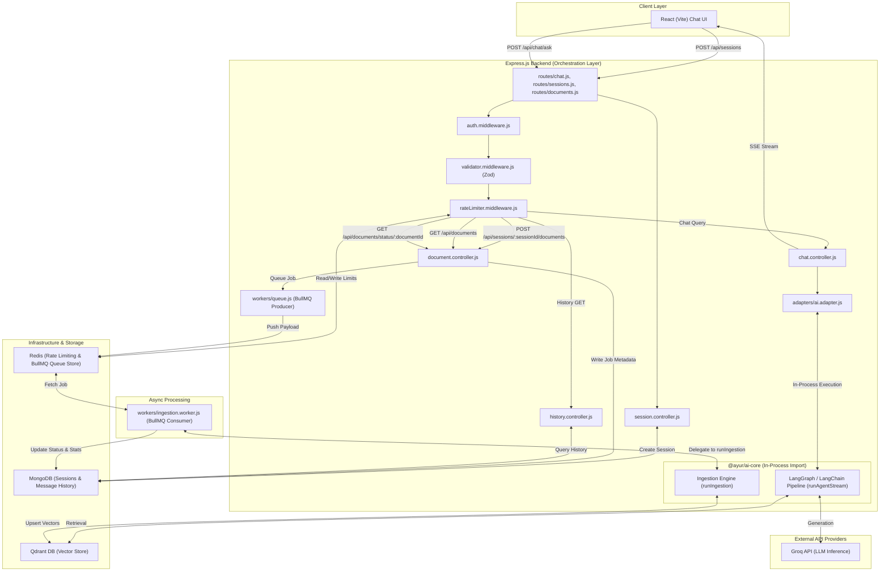

# Comprehensive System Design: Ayurveda IP Classification Backend

This document details the system design, API contracts, architectural strategies, database models, and validation rules for the backend orchestration layer of the Ayurveda IP Classification legal-reasoning RAG assistant.

---

## 1. System Architecture Diagram

Below is the high-level system architecture mapping client requests, middleware validations, cache/queue layers, and database/LLM integrations:



---

## 2. Request Lifecycle for `/ask` and `/sessions`

### Session Ownership & Setup
The backend is the owner of session identifiers to guarantee uniqueness and integrity.
1. Before commencing a chat, the client must request a new session via `POST /api/sessions`.
2. The `session.controller.js` creates a MongoDB `Session` document and returns a JSON payload containing the new 24-character hexadecimal ObjectId, explicitly returning an **HTTP 201 Created** status code:
   ```javascript
   // Successful session creation response
   res.status(201).json({ sessionId: sessionDoc._id.toString() });
   ```
3. During sub-queries, the client attaches this `sessionId`. If the request body lacks a `sessionId` or includes an invalid schema, `/api/chat/ask` will immediately reject the action with an HTTP 400 response instructing the client to initiate session setup first.

### `/ask` End-to-End Execution Flow
1. **HTTP Routing:** Client sends a `POST` request to `/api/chat/ask` containing the validated `sessionId`.
2. **Session Authentication:** `auth.middleware.js` evaluates cookies or bearer headers to populate user context.
3. **Payload Validation:** `validator.middleware.js` runs input data against `askRequestSchema` to verify query boundaries and object structures.
4. **Rate Limiting:** `rateLimiter.middleware.js` tracks IP and session buckets in Redis.
5. **Controller Dispatch:** `chat.controller.js` sets the SSE configuration headers and immediately flushes headers to open the response channel.
6. **AI Adapter Invocation:** `chat.controller.js` calls `streamAssessment` from `adapters/ai.adapter.js`. The adapter is a thin pass-through wrapper pointing to `@ayur/ai-core`'s streaming API.
7. **Streaming Output:** The adapter passes back an `AsyncGenerator` yielding pre-formatted events. The controller writes each event to the client on a single `data:` line.
8. **Completion Signal:** Upon completion or error, the controller ends the request channel.

---

## 3. Adapter Interface & Mock Pipeline Contracts

To decoupling testing, the dynamic adapter `ai.adapter.js` directs execution based on the `AI_ADAPTER_MOCK` configuration setting.

### Canonical Citation Shape
All citation payloads returned by the AI modules, stored in MongoDB, or generated by mock modules must adopt this canonical interface:

```typescript
interface Citation {
  id: string;            // Unique grounding reference ID
  source: string;        // Name of document/legal framework (e.g. "Patents Act, 1970" or "TKDL Vol. II")
  section: string;       // Exact legal code reference (e.g. "Section 3(p)")
  snippet: string;       // Direct context quote extracted from reference literature
  confidence: "high" | "medium" | "low"; // Verification confidence assessment
  url: string | null;    // URL link to source documentation (null if unavailable)
}
```

### Dynamic Adapter Signature Mapping
To maintain zero reshaping of outputs and direct integration with `@ayur/ai-core`'s interface, `streamAssessment` calls `runAgentStream` with a **single object argument**, matching ai-core's payload-style signature exactly.

#### Call Site Implementation in `adapters/ai.adapter.js`
```javascript
import { runAgentStream } from '@ayur/ai-core';

/**
 * Adapter interface mapping input arguments directly to the single-object runAgentStream contract
 * 
 * @param {string} query - The user's Ayurvedic formulation query.
 * @param {Object} context - Context options.
 * @param {string} context.sessionId - Valid MongoDB ObjectId string representing session.
 * @param {Array<Object>} [context.history] - Array of previous chat messages.
 * @param {Object} [context.options] - Extensible configuration parameters.
 * @returns {AsyncGenerator<StreamPayload, void, unknown>} Async generator yielding events.
 */
export function streamAssessment(query, { sessionId, history, options } = {}) {
  return runAgentStream({ query, sessionId, history, options });
}
```

---

## 4. SSE Streaming Protocol & Backpressure

### SSE Response Wire Format
All events written to the SSE stream must follow a **single-line, JSON-encoded, type-in-payload** contract.

- **Standard Token:**
  `data: {"type":"token","data":"Under"}\n\n`
- **Citations Payload:**
  `data: {"type":"citations","data":[{"id":"cit-001","source":"Patents Act, 1970","section":"Section 3(p)","snippet":"...","confidence":"high","url":null}]}\n\n`
- **Error Payload (Flat Error Structure):**
  `data: {"type":"error","message":"Query processing timeout"}\n\n`
- **Completion Payload:**
  `data: {"type":"done"}\n\n`

### Controller Streaming & Single-Terminal Event Logic
The `chat.controller.js` implements the streaming write loop, ensuring that exactly one terminal event (`done` or `error`, never both) is emitted per request. 

- **Natural Completion Path:** Emit `done` only when the async generator successfully finishes processing.
- **Error Path:** Emit `error` only (and terminate execution) if an error occurs.
- **Cleanup Block:** The `finally` block runs cleanup tasks and releases resources (calling `res.end()`), but never writes any SSE events to the wire.

```javascript
const writeEvent = (eventObj) => {
  return res.write(`data: ${JSON.stringify(eventObj)}\n\n`);
};

try {
  // Call dynamically loaded adapter with single-object payload parameter alignment
  const generator = streamAssessment(query, { sessionId, history: historyOverride });
  let terminalSent = false;

  for await (const event of generator) {
    if (event.type === 'error') {
      writeEvent({ type: 'error', message: event.message });
      terminalSent = true;
      break;
    }
    
    if (event.type === 'done') {
      writeEvent({ type: 'done' });
      terminalSent = true;
      break;
    }

    const ok = writeEvent(event);
    if (!ok) {
      // Handle socket backpressure
      await new Promise((resolve) => res.once('drain', resolve));
    }
  }

  // If the generator ends naturally without having explicitly yielded 'done' or 'error'
  if (!terminalSent) {
    writeEvent({ type: 'done' });
  }
} catch (error) {
  logger.error(error, 'Unhandled error during AI stream assessment');
  writeEvent({ type: 'error', message: 'An internal error occurred during generation' });
} finally {
  // Graceful teardown: close socket, release resources. No additional SSE write happens here.
  res.end();
}
```

---

## 5. Input Validation & Zod Schema Specifications

Zod validation rules reside in `src/schemas/` to inspect payloads prior to controller execution.

```javascript
import { z } from 'zod';
import { DOCUMENT_CATEGORIES } from '../constants/documentCategory.js';

/**
 * Validation schema for POST /api/sessions
 */
export const createSessionSchema = z.object({
  body: z.object({
    title: z.string().min(2).max(100).optional(),
  }).optional(),
});

/**
 * Validation schema for query stream endpoint POST /api/chat/ask
 */
export const askRequestSchema = z.object({
  body: z.object({
    query: z.string()
      .min(3, { message: 'Query must be at least 3 characters long' })
      .max(1000, { message: 'Query must not exceed 1000 characters' })
      .trim(),
    sessionId: z.string().regex(/^[0-9a-fA-F]{24}$/, { message: 'Session ID must be a valid 24-character hexadecimal MongoDB ObjectId' }),
    historyOverride: z.array(
      z.object({
        role: z.enum(['user', 'assistant'], { message: 'Role must be user or assistant' }),
        content: z.string().min(1, { message: 'Message content cannot be empty' }),
      })
    ).optional(),
  }),
});

/**
 * Validation schema for document ingestion upload
 * Route: POST /api/sessions/:sessionId/documents
 */
export const documentUploadSchema = z.object({
  params: z.object({
    sessionId: z.string().regex(/^[0-9a-fA-F]{24}$/, { message: 'Invalid session MongoDB ObjectId format' }),
  }),
  body: z.object({
    title: z.string().min(2, { message: 'Document title must be at least 2 characters' }).max(255).optional(),
    category: z.enum(DOCUMENT_CATEGORIES, {
      required_error: 'Category is required',
    }),
  }),
});
```

---

## 6. Document API Contracts (Upload, Status, & Listing)

### 1. Document Categories Shared Constant
To prevent drift, the system categories are defined in a shared constant `src/constants/documentCategory.js` and imported by the models, validations, and worker scripts:
```javascript
export const DOCUMENT_CATEGORIES = ['classical_text', 'patent_doc', 'legal_precedent', 'guideline'];
```

### 2. Document Upload Endpoint
- **Method & Route Path:** `POST /api/sessions/:sessionId/documents`
- **Content-Type:** `multipart/form-data`
- **Upload Fields Contract:**
  - `file` (binary, required): PDF/Text payload (max 15MB).
  - `category` (string, required): One of the values in the canonical categories enum.
  - `title` (string, optional): Document title. Defaults to `file.originalname` if omitted.
- **Controller Action:** The controller populates the `filename` schema property from `req.file.originalname` (raw upload name, independent of the optional user-supplied `title`).
- **Success Response (`202 Accepted`):**
  ```json
  {
    "documentId": "65b90f48f4384a6c8c4a92c1",
    "status": "PENDING"
  }
  ```
- **Validation Failure Response (`400 Bad Request`):**
  ```json
  {
    "error": "Validation Error",
    "code": "REQUEST_VALIDATION_FAILED",
    "details": [
      {
        "field": "category",
        "message": "Category is required"
      }
    ]
  }
  ```

### 3. Document Listing Endpoint
Exposes status logs of uploaded files to feed UI logs.
- **Method & Route Path:** `GET /api/documents`
- **Controller Action:** `listDocuments` in `src/controllers/document.controller.js`.
- **Database Query:** Retrieves all documents from the `IngestionJob` collection, sorted by `createdAt` descending.
- **Field Mapping:** Selects `filename`, `category`, `createdAt` (exposed as `uploadedAt`), `ingestedCount` (exposed as `chunkCount`), and lowercased `status`.
- **Response Format (`200 OK`):**
  ```json
  [
    {
      "documentId": "65b90f48f4384a6c8c4a92c1",
      "filename": "TKDL_Ayurveda_Formulations.pdf",
      "category": "classical_text",
      "uploadedAt": "2026-08-26T00:30:00Z",
      "chunkCount": 42,
      "status": "completed"
    }
  ]
  ```
  > [!TIP]
  > The controller maps uppercase database state strings (`PENDING`, `PROCESSING`, `COMPLETED`, `FAILED`) to lowercase statuses (`pending`, `processing`, `completed`, `failed`) to match frontend expectations.

### 4. Document Status Polling Endpoint
- **Method & Route Path:** `GET /api/documents/status/:documentId`
- **Controller Action:** Selects `filename`, lowercased `status`, `progress`, and `errorMessage` (exposed as `error`).
- **Response Format (`200 OK`):**
  ```json
  {
    "documentId": "65b90f48f4384a6c8c4a92c1",
    "filename": "TKDL_Ayurveda_Formulations.pdf",
    "status": "processing",
    "progress": 45,
    "error": null
  }
  ```

---

## 7. Multiplier-Aware Rate Limiting Strategy

Free LLM endpoints (like Groq's developer tier) impose restrictive limits on Requests Per Minute (RPM) and Tokens Per Minute (TPM).

### The Request Multiplier Challenge
A single client query `/api/chat/ask` does not map to a single LLM request. The underlying RAG system runs multiple downstream processes:
1. **Classification Task:** Evaluates if the query is Ayurveda-related ($1$ call).
2. **Retrieval Translation:** Formulates search queries for Qdrant ($1$ call).
3. **Assessment Synthesis:** Synthesizes the legal assessment from retrieved documents ($1$ call).
4. **Legal Compliance Review:** Double-checks citations for accuracy before outputting ($1$ call).

As a result, each client request has a **downstream multiplier ($M$) of 4 calls**.

### Redis Rate Limiter Configuration
To protect the system from rate limit errors during a demo or presentation, the rate limiter uses a sliding window token-bucket algorithm backed by **Redis**:

- **Global Target Limits (Groq Free Tier):** 30 RPM.
- **Backend Rate Limit Policy:**
  - With a multiplier of $M = 4$, the Express backend can handle a maximum of **7 concurrent customer queries per minute** across the system before risking API failures.
  - The middleware uses `express-rate-limit` combined with `rate-limit-redis` and `ioredis` to block requests aggressively, returning HTTP 429 with `Retry-After` headers matching the remaining quota refresh time.
  - **Session Limit:** 3 query requests per rolling 2-minute window per session.
  - **IP Limit:** 5 query requests per rolling 2-minute window per IP.
  - **Graceful Degradation:** When limits are reached, the system returns a rate limit payload:
    ```json
    {
      "error": "Too Many Requests",
      "code": "API_RATE_LIMIT_EXCEEDED",
      "details": "The legal assistant is busy reviewing documents. Please pause for 45 seconds before asking another question."
    }
    ```

---

## 8. Document Ingestion Pipeline Architecture (BullMQ + Redis)

Document processing runs asynchronously via **BullMQ** to offload computation boundaries from the server event-loop.

### Task Delegation to `ai-core`
The background worker (`src/workers/ingestion.worker.js`) delegates parsing, chunking, and vector index generation to the imported in-process `@ayur/ai-core` package.

1. **File Ingestion Hand-Off:**
   - The user uploads a file via `POST /api/sessions/:sessionId/documents`.
   - `document.controller.js` saves the document file under `storage/uploads/`, saves original file name in `filename`, and inserts a metadata document into MongoDB with status `PENDING`.
   - The controller enqueues a job in `ingestion-jobs` with job ID and file path parameters.
2. **Queue Execution:**
   - The `ingestion.worker.js` thread consumes the task payload.
   - It marks the MongoDB job status as `PROCESSING`.
   - The worker executes `runIngestion` from `@ayur/ai-core`, passing the canonical `category` string through verbatim:
     ```javascript
     import { runIngestion } from '@ayur/ai-core';

     const result = await runIngestion(job.data.filePath, {
       title: job.data.title,
       category: job.data.category, // Matches canonical enum ('classical_text' | 'patent_doc' | etc.)
     });
     // Expected output: { ingestedCount: number, timeTakenMs: number }
     ```
   - On success, the worker saves the execution metrics and changes the MongoDB job status to `COMPLETED`.
   - If `runIngestion` raises an exception, the worker updates the status to `FAILED`, storing the error trace directly on the job schema for diagnosis.

### MongoDB Ingestion Job Schema

```javascript
import mongoose from 'mongoose';
import { DOCUMENT_CATEGORIES } from '../constants/documentCategory.js';

const IngestionJobSchema = new mongoose.Schema({
  title: { type: String, required: true },
  filename: { type: String, required: true }, // Raw uploaded filename, distinct from user-editable title
  category: { 
    type: String, 
    required: true, 
    enum: DOCUMENT_CATEGORIES 
  },
  filePath: { type: String, required: true },
  status: { 
    type: String, 
    required: true, 
    enum: ['PENDING', 'PROCESSING', 'COMPLETED', 'FAILED'], 
    default: 'PENDING' 
  },
  progress: { type: Number, default: 0, min: 0, max: 100 },
  errorMessage: { type: String, default: null },
  ingestedCount: { type: Number, default: 0 },
  timeTakenMs: { type: Number, default: 0 }
}, { timestamps: true });

export const IngestionJob = mongoose.model('IngestionJob', IngestionJobSchema);
```

---

## 9. Session/History Storage Schema (MongoDB)

To support scaling and flexible document models, the system uses **MongoDB** (via Mongoose) to persist chat histories.

### Mongoose Schema Definitions

```javascript
import mongoose from 'mongoose';

// Citation Subdocument Schema
const CitationSchema = new mongoose.Schema({
  id: { type: String, required: true },
  source: { type: String, required: true },
  section: { type: String, required: true },
  snippet: { type: String, required: true },
  confidence: { 
    type: String, 
    required: true, 
    enum: ['high', 'medium', 'low'] 
  },
  url: { type: String, default: null } // Optional external citation link
});

// Message Schema
const MessageSchema = new mongoose.Schema({
  sessionId: { 
    type: mongoose.Schema.Types.ObjectId, 
    ref: 'Session', 
    required: true, 
    index: true 
  },
  role: { 
    type: String, 
    required: true, 
    enum: ['user', 'assistant'] 
  },
  content: { type: String, required: true },
  citations: [CitationSchema],
}, { timestamps: { createdAt: true, updatedAt: false } });

// Session Schema
const SessionSchema = new mongoose.Schema({
  title: { type: String, required: true, default: 'New Assessment' },
}, { timestamps: true });

export const Session = mongoose.model('Session', SessionSchema);
export const Message = mongoose.model('Message', MessageSchema);
```

---

## 10. Global Error Handling & Observability

### Global Exception Normalizer (`middleware/error.middleware.js`)
The application registers a final error-catching middleware to ensure all API responses remain structured and predictable:

```javascript
export function errorMiddleware(err, req, res, next) {
  const correlationId = req.id || 'system-action';
  
  // Log full error stack internally
  logger.error({
    correlationId,
    message: err.message,
    stack: err.stack,
    path: req.path,
  });

  // Handle Zod validation errors
  if (err.name === 'ZodError') {
    return res.status(400).json({
      error: 'Validation Error',
      code: 'REQUEST_VALIDATION_FAILED',
      details: err.errors.map(e => ({ field: e.path.join('.'), message: e.message })),
    });
  }

  // Handle Multer upload errors
  if (err.code === 'LIMIT_FILE_SIZE') {
    return res.status(400).json({
      error: 'Payload Too Large',
      code: 'UPLOAD_SIZE_EXCEEDED',
      details: 'Uploaded documents must not exceed 15MB.'
    });
  }

  // Return generic error payload for unhandled exceptions in production
  const isDev = process.env.NODE_ENV === 'development';
  res.status(err.statusCode || 500).json({
    error: err.statusCode === 404 ? 'Resource Not Found' : 'Internal Server Error',
    code: err.errorCode || 'INTERNAL_SERVER_ERROR',
    details: isDev ? err.message : 'An unexpected error occurred during execution.',
  });
}
```

### Structured Monitoring Layout (`config/logger.js`)
We use structured, machine-readable JSON logging (via Pino or Winston) to trace operations during local runs and deployments.

#### Log Schema and Metrics
Every API request writes a structured record to the log stream:
- **`correlationId`:** A unique request identifier generated at the router entry point.
- **`latencyMs`:** Total time elapsed from request receipt to response completion.
- **`metrics`:** When calling LLM endpoints, the logs capture token counts and prompt metrics:
  ```json
  {
    "level": "info",
    "timestamp": "2026-08-26T00:35:10.124Z",
    "correlationId": "9b1deb4d-3b7d-4bad-9bdd-2b0d7b3dcb6d",
    "sessionId": "65b90f48f4384a6c8c4a92c1",
    "endpoint": "/api/chat/ask",
    "latencyMs": 3420,
    "metrics": {
      "promptTokens": 1024,
      "completionTokens": 256,
      "totalTokens": 1280,
      "vectorSearchCount": 1,
      "vectorSearchLatencyMs": 120
    }
  }
  ```
> [!TIP]
> Group logs under namespace variables (e.g. `[INGESTION_WORKER]`, `[AI_ADAPTER]`) to simplify filtering logs inside container output or shell instances.
